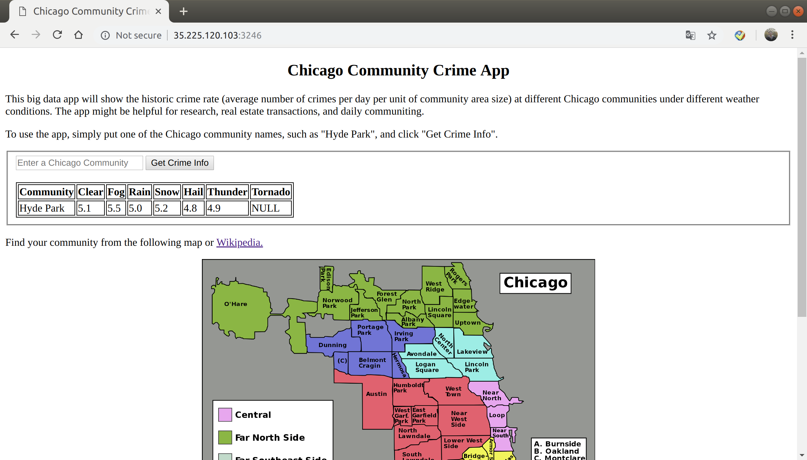

# Chicago Community Crime App

Lei Mao

University of Chicago

## Introduction

This Chicago Community Crime App is a big data app that will show the historic crime rate (average number of crimes per day per unit of community area size) at different Chicago communities under different weather conditions. The app might be helpful for research, real estate transactions, and daily communiting.

This big data app is implemented using [Lambda Architecture](https://en.wikipedia.org/wiki/Lambda_architecture), containing Batch Layer, Serving Layer, and Speed Layer (Speed Layer remains to be implemented).

<p align="center">
    
</p>


## Dependencies

* Apache Hadoop 2.7.3
* Apache Hive 2.1.0
* Apache HBase 1.1.2
* Beeline 2.1.0
* Apache Kafka 2.11-1.0.0
* Apache Thrift 0.11.0
* Apache Spark 2.3.0
* NodeJS 10.13.0

## Datasets

* [Chicago Crimes Dataset](https://data.cityofchicago.org/Public-Safety/Crimes-2001-to-present/ijzp-q8t2)
* [NOAA GSOD Dataset](https://data.noaa.gov/dataset/dataset/global-surface-summary-of-the-day-gsod)

## Start App

### Start App Locally

#### Start Backend Services

```bash
$ cd ./backend/
$ ./start_backend.sh --download-data
```

``--download-data`` is not required if you have already downloaded the data.

#### Start Frontend Services

```bash
$ cd ./frontend/
$ ./start_frontend.sh
```

To start the app "permanently":

```bash
$ cd ~/project/frontend/app/
$ node leimao_app.js &
```

### Start App on Cloud

#### Send Files to Cloud

Send backend files to ``class-m-0-20181017030211`` where HDFS is installed:

```bash
$ tar -czvf ./backend.tar.gz ./backend/
$ gcloud compute ssh leimao@class-m-0-20181017030211 --command='rm -rf ~/project/'
$ gcloud compute ssh leimao@class-m-0-20181017030211 --command='mkdir -p ~/project/'
$ gcloud compute scp ./backend.tar.gz leimao@class-m-0-20181017030211:~/project/
$ rm ./backend.tar.gz
```

Send frontend files to ``appserver``:

```bash
$ tar -czvf ./frontend.tar.gz ./frontend/
$ gcloud compute ssh leimao@appserver --command='rm -rf ~/project/'
$ gcloud compute ssh leimao@appserver --command='mkdir -p ~/project/'
$ gcloud compute scp ./frontend.tar.gz leimao@appserver:~/project/
$ rm ./frontend.tar.gz
```


#### Start Backend Services

Connect to Google Cloud ``class-m-0-20181017030211``:

```bash
$ gcloud compute ssh leimao@class-m-0-20181017030211
```

In Google Cloud:

```bash
$ tar xvf ~/project/backend.tar.gz -C ~/project/
$ chmod +x ~/project/backend/start_backend_cloud.sh
$ cd ~/project/backend/
$ ./start_backend_cloud.sh --download-data
```

``--download-data`` is not required if you have already downloaded the data.

#### Start Frontend Services

Connect to Google Cloud ``appserver``:

```bash
$ gcloud compute ssh leimao@appserver
```

In Google Cloud:

```bash
$ tar xvf ~/project/frontend.tar.gz -C ~/project/
$ chmod +x ~/project/frontend/start_frontend_cloud.sh
$ cd ~/project/frontend/
$ ./start_frontend_cloud.sh
```

To start the app "permanently":

```bash
$ cd ~/project/frontend/app_cloud/
$ node leimao_app.js &
```

To kill the app:

```bash
$ top -U leimao
$ kill -09 PID
```

## Use App

### Visit App Locally

Go to [``http://127.0.0.1:3000/``](http://127.0.0.1:3000/) in browser.

### Visit App on Cloud

``http://35.225.120.103:3246/``

Go to [``http://35.225.120.103:3246/``](http://35.225.120.103:3246/) in browser.


## Notes

* Zookeeper sometimes dies. Reboot all zookeeper if necessary.


## To-Do List

- [ ] Implement Speed Layer using Kafka and Spark Streaming.
- [ ] Incorporate GPS coordinates.
- [ ] Integrate map with data in GUI.